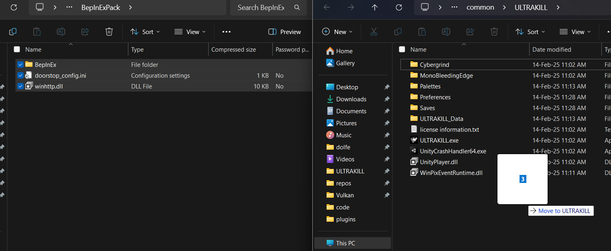
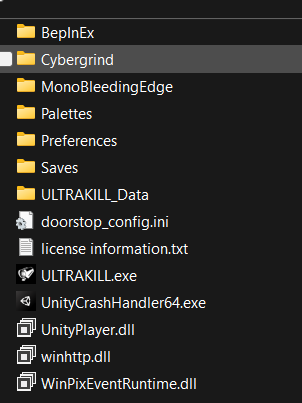

import Tabs from '@theme/Tabs';
import TabItem from '@theme/TabItem';

<Tabs>
  <TabItem value="apple" label="Apple" default>
    This is an apple 🍎
  </TabItem>
  <TabItem value="orange" label="Orange">
    This is an orange 🍊
  </TabItem>
  <TabItem value="banana" label="Banana">
    This is a banana 🍌
  </TabItem>
</Tabs> 

## Bepinex Setup

You can also follow this if you wish to play mods

Download bepinex from: [https://thunderstore.io/package/download/BepInEx/BepInExPack/5.4.2100/](https://thunderstore.io/package/download/BepInEx/BepInExPack/5.4.2100/)

Extract the zip file and open it, then open the BepInEx folder.

Copy the folder contents into the ULTRAKILL folder (where the ULTRAKILL.exe is)

Result:

After the contents have been put in the ULTRAKILL folder launch ULTRAKILL

When ultrakill gets to the main menu close it

Open the BepInEx folder then open the config folder
Open BepInEx.cfg with notepad or any text editor of your choosing

Change the line:
HideManagerGameObject = false
Change to:
HideManagerGameObject = true

Under [Logging.Console]
set enabled to true
If you are following this to play mods and not make mods keep the console disabled

