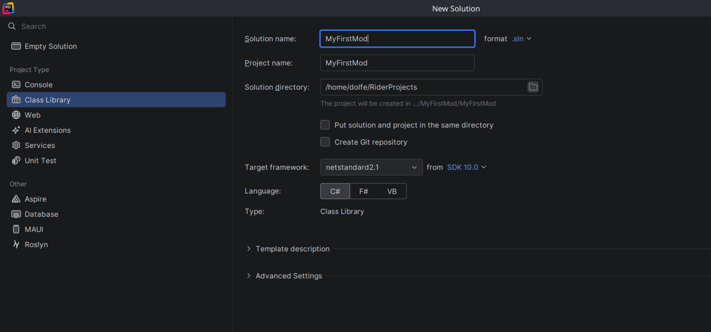
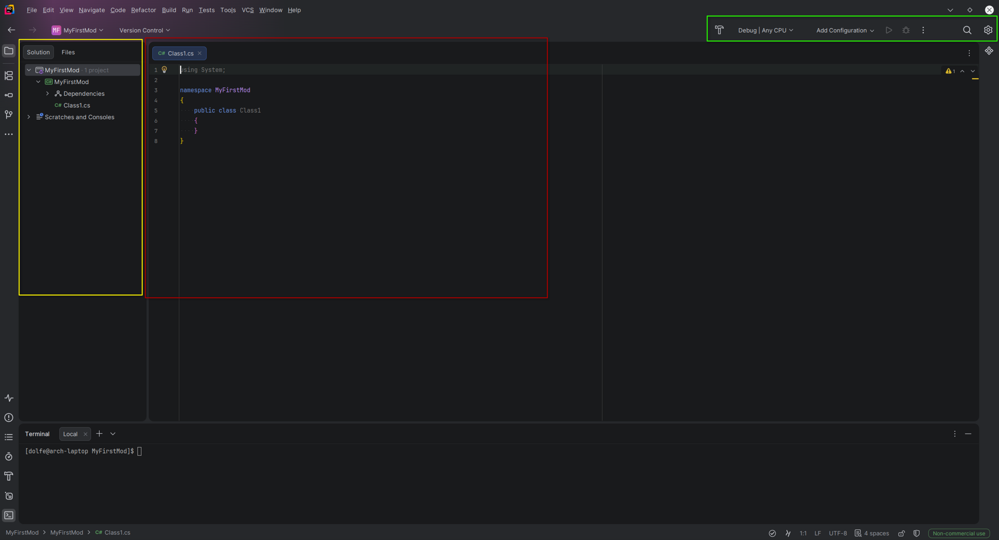
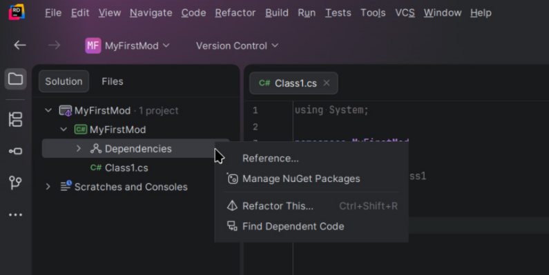
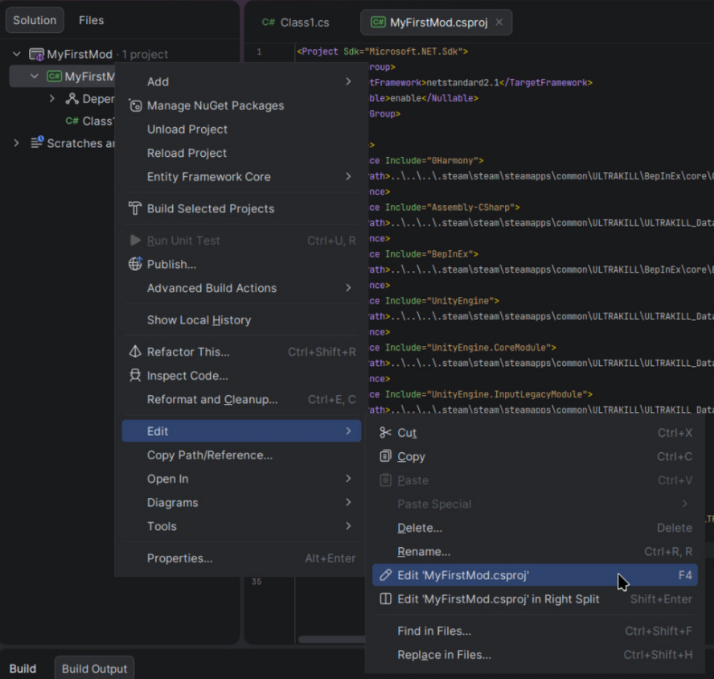
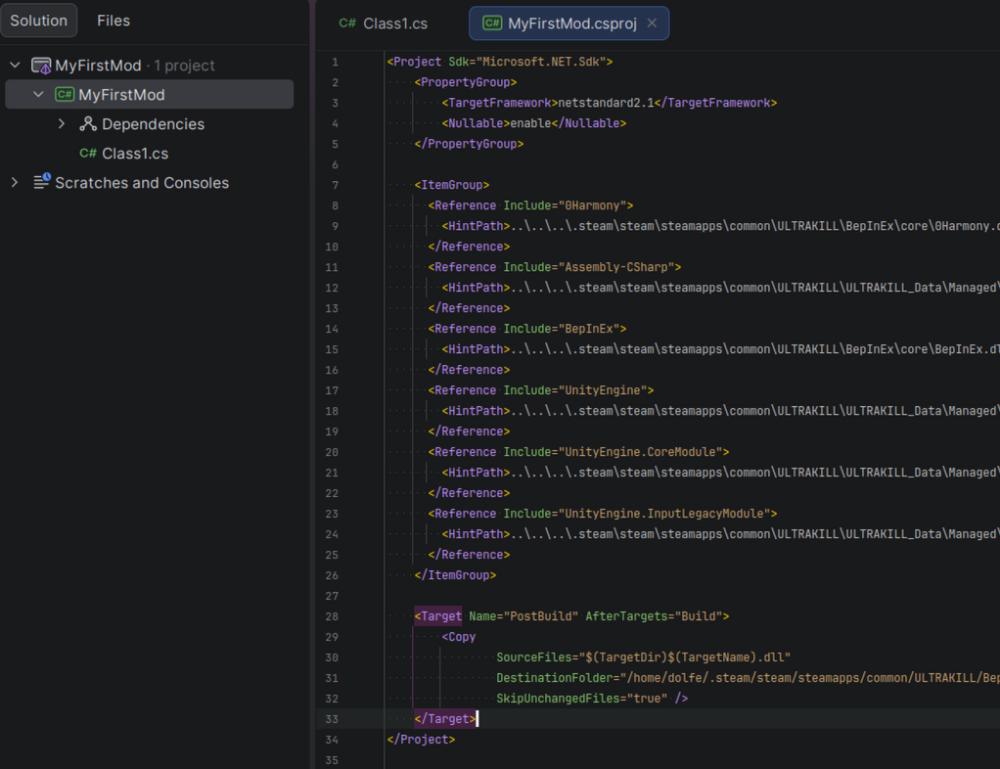

import {themes as prismThemes} from 'prism-react-renderer';

# Your First Mod

In this guide, you'll create a simple **"Hello World"** BepInEx plugin for ULTRAKILL.

:::info Prerequisites
Make sure you've completed the [Installation & Setup](./installation.mdx) guide before continuing. You'll need BepInEx installed and JetBrains Rider ready.
:::

---

## Creating the Project

1. **Open JetBrains Rider** and click **New Solution**
2. **Select Class Library** from the project types
3. **Configure your project**:
   - Set the **Solution name** to something like `MyFirstMod`
   - Set the **Target Framework** to `netstandard2.1` (this is what ULTRAKILL uses)

4. **Click Create**

## The UI Explained

In this screenshot these 3 highlighted areas are the most important currently
- In the Red box is the Code editor
- In the Yellow box is the Explorer
- In the Green box is Building and settings

### The code editor

This is where you'll spend most of your time. When you open or create a file it will appear here as a tab.

Rider helps you write code with:
- **Autocomplete** press `Ctrl+Space` to suggest completions as you type
- **Error highlighting** red underlines mean something is wrong, hover over them to see why
- **Quick fixes** click the lightbulb (or press `Alt+Enter`) on a highlighted issue to see fix suggestions
- **Go to definition** `Ctrl+Click` any class or method to jump to where it's defined

:::tip
If the editor looks overwhelming, don't worry, you only need to focus on the file that's open. Everything else is just there when you need it.
:::

### The Explorer

The Explorer shows all the files and folders in your project. You'll use it to navigate between your `.cs` files and open new ones.

- **Single-click** a file to preview it, **double-click** to open it properly in the editor
- **Right-click** a file or folder to get options like rename, delete, or add a new file

:::tip
If you can't see the Explorer, press `Alt+1` to open it.
:::

### The Builder

The Builder is how you compile your mod into a `.dll` file that ULTRAKILL can load.

- **Build** Click the hammer icon to compile your project
- **Errors** If something is wrong with your code, they'll appear here with a description and a link to the exact line
- **Output path** Your compiled `.dll` will be placed in `bin/Debug/netstandard2.1/` inside your project folder, this is the file you copy into `BepInEx/plugins/`

:::tip
Always check the Builder output after compiling a successful build shows `Build succeeded` with 0 errors. If there are errors, fix them before copying the `.dll` to your plugins folder, otherwise the old version of your mod will still be running.
:::

### Adding References

Your mod needs to reference BepInEx and ULTRAKILL's assemblies so you can code

1. **Right-click Dependencies** in the Solution Explorer > **Reference...**

2. **Referencing the `.dll` files**
    - In the opened menu, Click Add From...
    - Go to your ULTRAKILL dir
    - First add the BepInEx dlls
        - In the ULTRAKILl dir, Open BepInEx, then core
        - Hold CTRL then click `BepInEx.dll` and `0Harmony.dll`
        - Press Ok
    - Reopen the menu
    - Now adding the ULTRAKILL dlls
        - In the ULTRAKILL dir, Open ULTRAKILL_Data, then Managed
        - Hold CTRL then click: 
        - `Assembly-CSharp.dll` (Ultrakill's code)
        - `UnityEngine.dll` (Unity's code)
        - `UnityEngine.CoreModule.dll` (Unity's core code)
        - `UnityEngine.InputLegacyModule.dll` (For basic input for this tutorial)
        - Finally press Ok

---

## Writing the Plugin

Every BepInEx plugin needs two things: a `[BepInPlugin]` attribute and a class that extends `BaseUnityPlugin`. Rename the default `Class1.cs` file to `Plugin.cs`, then write the following:

```csharp
using BepInEx;
using BepInEx.Logging;
using UnityEngine;

namespace MyFirstMod
{
    [BepInPlugin("yourname.ultrakill.tutorialmod", "Tutorial Mod", "1.0.0")]
    public class Plugin : BaseUnityPlugin
    {
        internal static ManualLogSource Log;
        
        private void Awake()
        {
            Log = Logger;
            Log.LogInfo("Hello world!");
        }
    }
}
```

### Plugin Explained

The three strings in `[BepInPlugin]` are:
- **GUID** A unique ID for your mod, convention is `yourname.gamename.modname`. This should be unique, if two mods share the same GUID BepInEx will refuse to load one of them
- **Name** The display name of your mod, this is what shows up in the BepInEx console and log file
- **Version** Follows `major.minor.patch` format

#### The class
```csharp
public class Plugin : BaseUnityPlugin
```

The `: BaseUnityPlugin` part means your class **inherits** from BepInEx's `BaseUnityPlugin`. Without this, BepInEx won't recognize it as a plugin at all.

#### The logger
```csharp
internal static ManualLogSource Log;
```

This declares a `Log` variable that the whole class can use. Making it `static` means other classes in your mod can access it too via `Plugin.Log`.

#### Awake
```csharp
private void Awake()
{
    Log = Logger;
    Logger.LogInfo("Hello world!");
}
```

`Awake()` is a Unity method that runs **once** when your mod is first loaded, before the game's main menu appears. This is where you set things up registering patches, loading config, assets and so on. You'll be putting a lot of code here as your mods get more complex.

:::tip
`Awake()` is not the only Unity method available to you. `Update()` runs every frame, and `Start()` runs once after `Awake()`. You'll use these later when you need to do things continuously.
:::

---

## Basic Logging

BepInEx provides a built-in logger you can use to print messages to the console and log file. There are a few log levels depending on what you want to communicate:

```csharp
Logger.LogInfo("Everything is working fine"); // general info
Logger.LogWarning("Something might be wrong"); // non fatal issues
Logger.LogError("Something went wrong"); // errors
```

Log messages show up in the BepInEx console window that opens alongside the game, and are also written to `BepInEx/LogOutput.log` if you need to check them after closing the game.

---

## Compiling and Testing

1. **Build the project** — In Rider, Press the hammer (In the Green Box [Shown here](#the-ui-explained)). If there are no errors, your `.dll` will be output to `bin/Debug/netstandard2.1/MyFirstMod.dll` inside your project folder.
2. **Copy the `.dll`** — Navigate to your ULTRAKILL installation folder, go into `BepInEx/plugins/`, and paste `MyFirstMod.dll` there. Launch ULTRAKILL, get to the main menu, then close if it doesn't exist.
3. **Launch ULTRAKILL** — Start the game normally via Steam.

:::tip
To speed up testing, you can set make Rider copy the dll automatically
This is a snippet you can add to your .csproj to make that happen:
```xml
<Project Sdk="Microsoft.NET.Sdk">
    <PropertyGroup>
        ...
    </PropertyGroup>
    
    <ItemGroup>
        ...
    </ItemGroup>
    
    <!-- Add this and replace `~YOUR ULTRAKILL PATH~` with your ULTRAKILL path: -->
    <Target Name="PostBuild" AfterTargets="Build">
        <Copy
            SourceFiles="$(TargetDir)$(TargetName).dll"
            DestinationFolder="~YOUR ULTRAKILL PATH~/ULTRAKILL/BepInEx/plugins/"
            SkipUnchangedFiles="true" />
    </Target>
</Project>
```
If you want to do this, open your csproj for editing:

And make the edit, it should look like: 

:::

---

## Seeing Your Mod Work In-Game

When ULTRAKILL launches, the BepInEx console window will open alongside it. Look for your message in the output:

```
[Info   :   BepInEx] Loading [Tutorial Mod 1.0.0]
[Info   :Tutorial Mod] Hello world!
```

If you see that line, your mod is working!

:::tip
If you don't see your log message, double-check that:
- Your `.dll` is in `BepInEx/plugins/`
- The BepInEx console is enabled in `BepInEx/config/BepInEx.cfg` (see the Setup guide)
- There are no build errors in Rider
:::