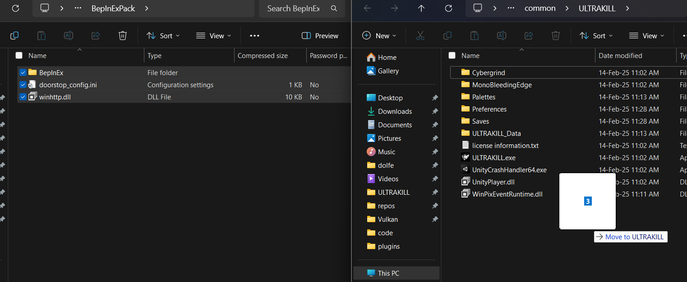
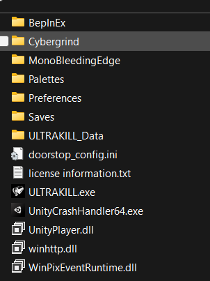

# Installation & Setup

This guide will walk you through setting up everything you need to start modding ULTRAKILL.

## Prerequisites To Modding

Before you begin, make sure you have:

### Required Software

- **ULTRAKILL** (or really any unity game but this wiki focuses on Ultrakill) - Make sure it's installed and runs properly
- **Jetbrains Rider Community Edition** or **Visual Studio 2022 Community** - For writing C# code, the wiki focuses on Rider because its cross platform
    - [Download Jetbrains Rider](https://www.jetbrains.com/rider/download/)
    - [Download Visual Studio Community](https://visualstudio.microsoft.com/vs/community/)
    - **dnSpy** - For examining game code and finding methods to patch
    - [Download dnSpy](https://github.com/dnSpy/dnSpy/releases) (get the latest release)

### Basic Knowledge

- **C# fundamentals** - Variables, methods, classes, and basic syntax
- **File management** - Copying files, navigating folders, editing text files
- **Problem-solving patience** - Modding involves lots of trial and error

:::tip New to C#?
Check out Microsoft's [C# fundamentals tutorial](https://docs.microsoft.com/en-us/learn/paths/csharp-first-steps/) before diving into modding, but you can also learn C# while modding, this is just a suggestion.
Or check out some unity tutorials, they will help you understand how unity works and how the mods interact.
:::

## BepInEx Setup

BepInEx is the mod loader that makes ULTRAKILL modding possible. Follow these steps carefully:

### Step 1: Download BepInEx

Download BepInEx from Thunderstore: [BepInExPack 5.4.2100](https://thunderstore.io/c/ultrakill/p/BepInEx/BepInExPack/)

:::warning Version Compatibility
Always use the specific BepInEx version recommended for ULTRAKILL modding. Newer versions might not be compatible and will break if people on a different version try to run your mod.
:::


### Step 2: Extract and Install

1. **Extract the zip file** and open the extracted folder
2. **Open the BepInEx folder** inside the extracted files
3. **Copy all contents** from this BepInEx folder, not the folder where the icon is
4. **Navigate to your ULTRAKILL installation** (where ULTRAKILL.exe is located)
   - Steam: Usually `C:\Program Files (x86)\Steam\steamapps\common\ULTRAKILL`
   - Other platforms: Check your game library
5. **Paste all files** into the ULTRAKILL folder and replace anything necessary



Your ULTRAKILL folder should now look like this:



### Step 3: Initial Setup

1. **Launch ULTRAKILL** and let it reach the main menu
2. **Close ULTRAKILL** - This creates the necessary BepInEx configuration files

### Step 4: Configure BepInEx for Development

1. **Open the BepInEx folder** in your ULTRAKILL directory
2. **Open the config folder**
3. **Edit BepInEx.cfg** with Notepad or any text editor

Make these changes:

```ini
# Find this line and change it:
HideManagerGameObject = true

# Under [Logging.Console] section, change:
Enabled = true
```

:::info For Mod Users Only
If you're only installing mods (not creating them), keep the console disabled by leaving `Enabled = false`.
:::

### Step 5: Verify BepInEx is working

1. **Launch ULTRAKILL again**
2. **Look for a console window** that opens alongside the game - this confirms BepInEx is working
3. **Check the console output** for any error messages, ignore any errors from ultrakill, just your own mod, you can also look at ULTRAKILL's built in console by pressing

## Development Tools Setup

### Jetbrains Rider Setup

1. **Download and install Jetbrains Rider** from the [official website](https://www.jetbrains.com/rider/download/).
2. **TODO**

### DnSpy Setup

1. **Download dnSpy** from the [GitHub releases page](https://github.com/dnSpy/dnSpy/releases).
2. **Extract the downloaded zip file** to a folder of your choice.
3. **Run dnSpy.exe** to open the application.
4. **Open the ULTRAKILL assembly**:
   - Click `File` > `Open...`
   - Navigate to your ULTRAKILL installation folder
   - Select `ULTRAKILL_Data\Managed\Assembly-CSharp.dll`
5. **Optional but recommended** try to open a .dll file and set DnSpy as the default program for .dll files so you can open them by double clicking them.

## What's Next?

With BepInEx installed and working you're ready to create your [first mod](first-mod.mdx)!

The next guide will walk you through creating a simple "Hello World" plugin to verify everything is working correctly and to teach the basics.